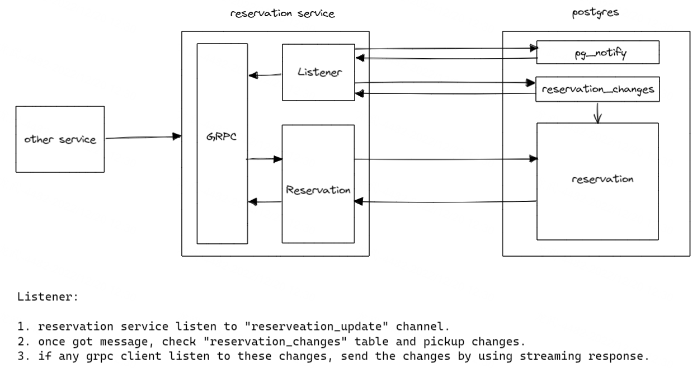

# Core Reservation Service

- Feature Name: core-reservation-service
- Start Date: 2022-12-19 18:49:30

## Summary

A core reservation service that solves the problem of reserving a resource for a specific time period. We leverage postgres EXCLUDE constraints to ensure that only one reservation can exist at a time for a given resource.

## Motivation

We need a common solution for various reservation requirements: 1) calendar booking; 2) hotel/room booking; 3) meeting room booking; 4) parking lot booking; 5) etc. Repeatedly implementing the same solution in different services is not only a waste of time, but also a waste of resources. We need a common solution that can be used by all services.

## Guide-level explanation

### Basic Architecture



### Service interface

We would use gRPC as a service interface. Below is the proto definition:

```proto
enum ReservationStatus {
    UNKNOWN = 0;
    PENDING = 1;
    CONFIRMED = 2;
    BLOCKED = 3;
}

message Reservation {
    string id = 1;
    string user_id = 2;
    ReservationStatus status = 3;

    // resource reservation window
    string resource_id = 4;
    google.protobuf.Timestamp start_time = 5;
    google.protobuf.Timestamp end_time = 6;

    // extra note
    string note = 7;
}

message ReserveRequest {
    Reservation reservation = 1;
}

message ReserveResponse {
    Reservation reservation = 1;
}

message UpdateRequest {
    string note = 1;
}

message UpdateResponse {
    Reservation reservation = 1;
}

message ConfirmRequest {
    string id = 1;
}

message ConfirmResponse {
    Reservation reservation = 1;
}

message CancelRequest {
    string id = 1;
}

message CancelResponse {
    Reservation reservation = 1;
}

message GetRequest {
    string id = 1;
}

message GetResponse {
    Reservation reservation = 1;
}

message QueryRequest {
    string resource_id = 1;
    string user_id = 2;
    // use status to filter result. If UNKNOWN, return all reservations
    ReservationStatus status = 3;
    google.protobuf.Timestamp start_time = 4;
    google.protobuf.Timestamp end_time = 5 ;
}

message WatchRequest {
}

message WatchResponse {
    int8 event = 1;
    Reservation reservation = 2;
}

service ReservationService {
    rpc reserve(ReserveRequest) returns (ReserveResponse);
    rpc confirm(ConfirmRequest) returns (ConfirmResponse);
    rpc update(UpdateRequest) returns (UpdateResponse);
    rpc cancel(CancelRequest) returns (CancelResponse);
    rpc get(GetRequest) returns (GetResponse);
    rpc query(QueryRequest) returns (stream Reservation);
    // another system could monitor reservation events
    rpc watch(WatchRequest) returns (stream Reservation);
}
```

### Database schema

We use postgres as the database. Below is the schema:

```sql
CREATE TYPE reservation_status AS ENUM ('unknown', 'pending', 'confirmed', 'blocked');
CREATE TYPE reservation_event AS ENUM ('unknown', 'create', 'update', 'delete');

CREATE TABLE reservation (
    id uuid NOT NULL DEFAULT uuid_generate_v4(),
    user_id varchar(64) NOT NULL,
    status reservation_status NOT NULL DEFAULT 'pending',
    resource_id varchar(64) NOT NULL,
    span tstzrange NOT NULL,
    note text,
    CONSTRAINT reservation_pk PRIMARY KEY (id),
    CONSTRAINT reservation_conflict EXCLUDE USING gist (resource_id WITH =, span WITH &&)
);
CREATE INDEX reservation_resource_id_idx ON reservation (resource_id);
CREATE INDEX reservation_user_id_idx ON reservation (user_id);

-- if user_id is null, find all reservations within duration for the resource
-- if resource_id is null, find all reservations within duration for the user
-- if both are null, find all reservations within duration
-- if both set, find all reservations within duration for the resource and user
CREATE OR REPLACE FUNCTION query(uid text, rid text, duration tstzrange) RETURNS TABLE reservation AS $$ $$ LANGUAGE plpgsql;

-- reservation event queue
CREATE TABLE reservation_events (
    id SERIAL NOT NULL,
    reservation_id uuid NOT NULL,
    event reservation_event NOT NULL
);

-- trigger for add/update/delete a reservation
CREATE OR REPLACE FUNCTION reservations_trigger() RETURNS TRIGGER AS $$
BEGIN
    IF TG_OP = 'INSERT' THEN
        -- update reservation_events
        INSERT INTO reservation_events (reservation_id, event) VALUES (NEW.id, 'create');
    ELSIF TG_OP = 'UPDATE' THEN
        -- if status changed, update reservation_events
        IF OLD.status <> NEW.status THEN
            INSERT INTO reservation_events (reservation_id, event) VALUES (NEW.id, 'update');
        END IF;
    ELSIF TG_OP = 'DELETE' THEN
        -- update reservation_events
        INSERT INTO reservation_events (reservation_id, event) VALUES (OLD.id, 'delete');
    END IF;
    -- notify a channel called reservation_event
    NOTIFY reservation_event;
    RETURN NULL;
END;
$$ LANGUAGE plpgsql;

CREATE TRIGGER reservations_trigger
    AFTER INSERT OR UPDATE OR DELETE ON reservations
    FOR EACH ROW EXECUTE PROCEDURE reservations_trigger();
```

## Reference-level explanation

TBD

## Drawbacks

N/A

## Rationale and alternatives

N/A

## Prior art

N/A

## Unresolved questions

- how to handle repeated reservation? - is this more or less a business logic which shouldn't be put into this layer? (non-goal: we consider this is a business logic and should be handled by the caller)
- if load is big, we may use an external queue for recording changes.
- we haven't considered tracking/observability/deployment yet.
- query performance might be an issue - need to revisit the index and also consider using cache.

## Future possibilities

N/A
